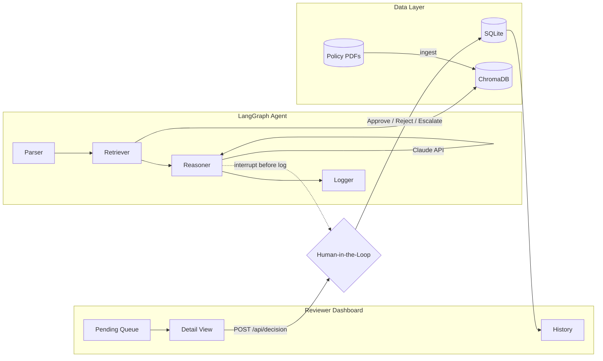

<div align="center">

# ClearAuth
### Health Plan Prior Authorization Intelligence

[](https://python.org)
[](https://fastapi.tiangolo.com)
[](https://langchain-ai.github.io/langgraph/)
[](https://anthropic.com)
[](LICENSE)

**An agentic AI system that automates first-pass prior authorization review using RAG, LangGraph, and human-in-the-loop decision routing.**

[Quick Start](#setup-fresh-clone) · [Architecture](#architecture) · [API Reference](#api-reference) · [Demo](#demo)

</div>

---

## What is ClearAuth?

Prior authorization delays care and costs health plans **billions in manual review hours** each year. ClearAuth is a proof-of-concept payer intelligence system that:

- **Ingests** CMS/NCD coverage policy PDFs into a vector database
- **Analyzes** prior auth requests against exact policy excerpts using a LangGraph agent
- **Recommends** APPROVE / FLAG / ESCALATE with confidence scores and policy citations
- **Routes every case through a human reviewer** before any decision is logged

> **All demo data is 100% synthetic — no real PHI is used or stored.**

Built as a **Cotiviti GenAI Developer Intern assessment** proof of concept, addressing Topics 2 (Clinical Decision Making & Agentic GenAI) and 3 (Content Management in Health Care).

---

## Why Both Assessment Topics?

Prior authorization sits at the intersection of **clinical criteria** and **payer policy content** — exactly where Cotiviti operates across Treatment, Payment, and Operations (TPO).

| Topic | ClearAuth Implementation |
|-------|--------------------------| 
| **Topic 2 — Clinical Decision Making & Agentic GenAI** | LangGraph agent with chain reasoning (parse → retrieve → reason), classification of coverage decisions, confidence scoring, and human-in-the-loop escalation |
| **Topic 3 — Content Management in Health Care** | Ingests CMS/NCD policy PDFs into ChromaDB, retrieves exact policy excerpts, cites source documents with page numbers, and links reviewers directly to source PDFs |

---

## Architecture



> Full diagram: [docs/langgraph_agent_diagram.svg](docs/langgraph_agent_diagram.svg) · [docs/langgraph_agent_diagram.md](docs/langgraph_agent_diagram.md)

### Pipeline Stages

| Stage | Description |
|-------|-------------|
| **1. Parser** | Structures the prior auth request (age, sex, ICD-10, CPT, procedure, urgency, clinical notes) into a retrieval query |
| **2. Retriever** | Embeds the query with `all-MiniLM-L6-v2`, searches ChromaDB for top policy chunks (relevance >= 0.35), attaches source file + page metadata |
| **3. Reasoner** | Claude `claude-sonnet-4-6` evaluates the request against retrieved excerpts **only** — anti-hallucination rules enforced; low confidence forces ESCALATE |
| **4. HITL** | LangGraph interrupts before `log_decision`; reviewer sees AI rationale + policy citations, then Approves, Rejects (reason required), or Escalates |

### Tech Stack

| Layer | Technology |
|-------|------------|
| Frontend | Single-page HTML + Tailwind CDN + Vanilla JS |
| API | FastAPI |
| Agent | LangGraph (`StateGraph` + `MemorySaver` + interrupt) |
| LLM | Anthropic Claude (`claude-sonnet-4-6`) |
| RAG | ChromaDB + sentence-transformers (`all-MiniLM-L6-v2`) |
| PDF Parsing | pdfplumber (800-char chunks, 100-char overlap) |
| Database | SQLite + SQLAlchemy |

---

## Key Features

### Reviewer Dashboard
- Pending queue with AI decision tags, expected labels (synthetic benchmark), and confidence scores
- KPI row: Pending, Approved, Rejected, Escalated, **Hours Saved** (reviews x 20 min)
- **Import CSV** for bulk request upload · **+ New Request** modal for ad-hoc cases

### Case Detail View
- Clinical request summary, evidence & rationale, step-by-step reasoning trace
- Retrieved policy chunks with relevance scores and **page-level PDF links**
- Approve / Reject (reason required) / Escalate with full review chain

### Data & Governance
- **Synthetic data only** — zero real patient identifiers
- Full 3-table audit trail: `prior_auth_requests` → `agent_analyses` → `human_decisions`
- Auto-escalation rules: emergent urgency, no policy found, or confidence < 60%

---

## Setup (Fresh Clone)

**Prerequisites:** Python 3.11+, [Anthropic API key](https://console.anthropic.com/), policy PDFs in `knowledge_base/`

```bash
# 1. Clone and enter the project
git clone https://github.com/noopurdiv/Health-Plan-Prior-Auth-Agentic-AI.git
cd Health-Plan-Prior-Auth-Agentic-AI

# 2. Create and activate a virtual environment
python -m venv .venv
source .venv/bin/activate        # macOS/Linux
# .venv\Scripts\activate         # Windows

# 3. Install dependencies
pip install -r requirements.txt

# 4. Configure environment
cp .env.example .env
# Edit .env → set ANTHROPIC_API_KEY=sk-ant-...

# 5. Add policy PDFs
# Place CMS/NCD or payer policy PDFs in knowledge_base/
# e.g., knowledge_base/ncd_colorectal_screening.pdf

# 6. Ingest PDFs into ChromaDB (run once, or when PDFs change)
python ingest_pdfs.py
# Expected: "Ingested N chunks from M files into ChromaDB"

# 7. Start the server
uvicorn src.api.main:app --reload --host 127.0.0.1 --port 8000
# Windows helper: .\run_server.ps1  (kills stuck port, excludes scripts/ from reload)
```

Open **http://localhost:8000** — wait for `Pre-analyzed N pending request(s)` in the terminal before demoing.

### Environment Variables

| Variable | Default | Description |
|----------|---------|-------------|
| `ANTHROPIC_API_KEY` | — | **Required.** LLM reasoning key |
| `ANTHROPIC_MODEL` | `claude-sonnet-4-6` | Claude model ID |
| `CHROMA_DB_PATH` | `./chroma_db` | Vector store location |
| `KNOWLEDGE_BASE_PATH` | `./knowledge_base` | Policy PDF directory |
| `DATABASE_URL` | `sqlite:///./clearauth.db` | SQLite connection string |
| `HF_HUB_OFFLINE` | `1` | Use cached embedding model offline |
| `MANUAL_REVIEW_MINUTES` | `20` | Minutes saved per completed review (KPI) |

### Troubleshooting

| Issue | Fix |
|-------|-----|
| `No PDFs ingested` | Add `.pdf` files to `knowledge_base/` → re-run `python ingest_pdfs.py` |
| HuggingFace slow startup | Set `HF_HUB_OFFLINE=1` and `TRANSFORMERS_OFFLINE=1` in `.env` (after first model download) |
| AI tags show "Processing" | Wait for background pre-analysis; refresh pending list |
| `404` on model name | Ensure `ANTHROPIC_MODEL=claude-sonnet-4-6` in `.env` |
| `httpx` / `anthropic` error | `requirements.txt` pins `httpx==0.27.2` — reinstall with `pip install -r requirements.txt` |
| Port 8000 not loading | Kill stuck uvicorn: `Get-NetTCPConnection -LocalPort 8000` → `Stop-Process -Id <PID> -Force` |
| Reload loop after editing | Use `run_server.ps1` to exclude `scripts/` and `*.docx` from file watching |

---

## Project Structure

```
Health-Plan-Prior-Auth-Agentic-AI/
├── frontend/
│   └── index.html               # Dashboard UI (single-page app)
├── knowledge_base/              # Policy PDFs — add your own here
├── chroma_db/                   # Vector store (auto-created by ingest)
├── synthetic_data/
│   ├── sample_requests.json     # 50 synthetic cases + expected decisions
│   └── import_template.csv      # CSV bulk import template
├── src/
│   ├── agent/                   # LangGraph nodes + graph definition
│   ├── api/                     # FastAPI routes + CSV import handler
│   ├── db/                      # SQLAlchemy models, seed, pre-analyze
│   └── rag/                     # PDF ingest + ChromaDB retriever
├── docs/                        # Architecture diagrams
├── tests/                       # Pytest test suite
├── ingest_pdfs.py               # One-time PDF → ChromaDB ingestion
├── eval.py                      # Benchmark evaluation script
├── requirements.txt
└── .env.example
```

---

## API Reference

| Method | Path | Description |
|--------|------|-------------|
| `GET` | `/` | Dashboard UI |
| `GET` | `/api/health` | Health check + ChromaDB document count |
| `GET` | `/api/stats` | Hours saved KPI + decision counts |
| `GET` | `/api/pending` | Pending requests with cached AI analysis |
| `GET` | `/api/requests/{id}` | Full request + analysis + decision |
| `POST` | `/api/requests/{id}/analyze` | Return cached analysis |
| `POST` | `/api/analyze` | Submit new request and run analysis |
| `POST` | `/api/decision` | Submit human review (approve / reject / escalate) |
| `POST` | `/api/import/csv` | Bulk import requests from CSV |
| `GET` | `/api/history` | Completed requests |
| `GET` | `/api/history/{id}` | History detail |
| `GET` | `/api/policy/pdf/{filename}` | Serve policy PDF from `knowledge_base/` |

---

## Evaluation & Testing

Run the benchmark against synthetic expected labels:

```bash
python eval.py              # Human-readable output
python eval.py --json       # Machine-readable JSON output
```

Run the test suite:

```bash
python -m pytest tests/ -v
```

---

## About

Built by **Noopur Shekhar Divekar** — M.S. Data Science, Indiana University Bloomington

[](https://linkedin.com/in/noopurd)
[](https://noopurdiv.github.io)
[](mailto:noopur.div188@gmail.com)
