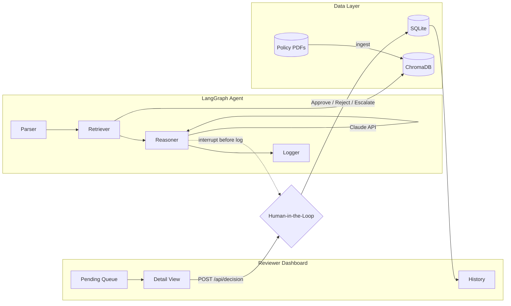

# ClearAuth — Health Plan Prior Authorization Intelligence

ClearAuth is an agentic prior authorization system for healthcare payers. It uses a RAG-powered LangGraph agent to read billing and coverage policy PDFs, produce evidence-grounded recommendations (APPROVE / FLAG / ESCALATE), and route every case through a human reviewer before a decision is logged.

Built as a Cotiviti GenAI Developer Intern assessment proof of concept. **All demo data is synthetic — no real PHI.**

---

## Cotiviti Assessment Topic

This project addresses **two** of the three assessment topics:

| Topic | How ClearAuth applies |
|-------|----------------------|
| **Topic 2 — Clinical Decision Making & Agentic GenAI** | LangGraph agent with chain reasoning (parse → retrieve → reason), classification of coverage decisions, confidence scoring, and human-in-the-loop escalation |
| **Topic 3 — Content Management in Health Care** | Ingests CMS/NCD policy PDFs into a vector database, retrieves exact policy excerpts, cites source documents with page numbers, and links reviewers to the underlying PDF |

**Why both?** Prior authorization sits at the intersection of **clinical criteria** and **payer policy content**. Cotiviti operates in Treatment, Payment, and Operations (TPO); this POC automates the first-pass policy review that today is manual, slow, and inconsistent — a direct fit for payment integrity and payer operations.

---

## Architecture

**LangGraph agent interaction diagram:** [docs/langgraph_agent_diagram.svg](docs/langgraph_agent_diagram.svg) (full visual) · [docs/langgraph_agent_diagram.md](docs/langgraph_agent_diagram.md) (Mermaid + node reference)



### Pipeline stages

1. **Parser** — Structures the prior auth request (age, sex, ICD-10, CPT, procedure, urgency, clinical notes) into a retrieval query and reasoning step.
2. **Retriever** — Embeds the query with `all-MiniLM-L6-v2`, searches ChromaDB for top policy chunks (relevance threshold ≥ 0.35), and attaches source file + page metadata.
3. **Reasoner** — Claude (`claude-sonnet-4-6`) evaluates the request against retrieved excerpts only, with anti-hallucination rules. Confidence is blended with retrieval scores; low confidence forces ESCALATE.
4. **Human-in-the-Loop (HITL)** — LangGraph interrupts before `log_decision`. The reviewer sees AI rationale, policy citations, and PDF links, then Approve, Reject (with reason), or Escalate. Escalated cases add a **Manager** step to the review chain.

### Tech stack

| Layer | Technology |
|-------|------------|
| Frontend | Single-page HTML + Tailwind CDN + vanilla JS |
| API | FastAPI |
| Agent | LangGraph (`StateGraph` + `MemorySaver` + interrupt) |
| LLM | Anthropic Claude (`claude-sonnet-4-6`) |
| RAG | ChromaDB + sentence-transformers (`all-MiniLM-L6-v2`) |
| PDF parsing | pdfplumber (800-char chunks, 100-char overlap) |
| Database | SQLite + SQLAlchemy |

---

## Setup (fresh clone)

**Prerequisites:** Python 3.11+, an [Anthropic API key](https://console.anthropic.com/), and policy PDFs in `knowledge_base/` (CMS NCD/LCD manuals work well).

```bash
# 1. Clone and enter the project
cd prior-auth-agent

# 2. Create a virtual environment (recommended)
python -m venv .venv
# Windows
.venv\Scripts\activate
# macOS / Linux
source .venv/bin/activate

# 3. Install dependencies
pip install -r requirements.txt

# 4. Configure environment
cp .env.example .env
# Edit .env and set ANTHROPIC_API_KEY=sk-ant-...

# 5. Add policy PDFs
# Place CMS/NCD or payer policy PDFs in knowledge_base/
# Example: knowledge_base/ncd_colorectal_screening.pdf

# 6. Ingest PDFs into ChromaDB (run once, or again when PDFs change)
python ingest_pdfs.py
# Expected output: "Ingested N chunks from M files into ChromaDB"

# 7. Start the server
uvicorn src.api.main:app --reload --host 127.0.0.1 --port 8000

# Or on Windows, use the helper script (kills stuck port 8000, excludes scripts/ from reload):
#   .\run_server.ps1
```

Open **http://localhost:8000**

### First startup behavior

On first launch the server will:

1. Warm up the embedding model and ChromaDB connection (singleton retriever)
2. Seed **50 synthetic prior auth requests** from `synthetic_data/sample_requests.json`
3. **Pre-analyze all pending requests in a background thread** (~5–15 s each after warmup)

Wait until the terminal shows `Pre-analyzed N pending request(s)` before demoing. The pending table will show AI tags and confidence scores when ready. Opening a record loads **cached analysis instantly** — no live LLM call on open.

### Troubleshooting

| Issue | Fix |
|-------|-----|
| `No PDFs ingested` | Add `.pdf` files to `knowledge_base/` and re-run `python ingest_pdfs.py` |
| HuggingFace download retries / slow startup | Set `HF_HUB_OFFLINE=1` and `TRANSFORMERS_OFFLINE=1` in `.env` (after first successful model download) |
| AI tags show "Processing" | Wait for background pre-analysis to finish; refresh the pending list |
| `404` on model name | Ensure `ANTHROPIC_MODEL=claude-sonnet-4-6` in `.env` |
| `httpx` / `anthropic` error | `requirements.txt` pins `httpx==0.27.2` — reinstall deps |
| `localhost:8000` not loading / times out | Old uvicorn stuck on port 8000. Run `.\run_server.ps1` or kill the process: `Get-NetTCPConnection -LocalPort 8000` then `Stop-Process -Id <PID> -Force`, then restart |
| Reload loop after editing report | Use `run_server.ps1` which excludes `scripts/` and `*.docx` from file watching |

### Environment variables

| Variable | Default | Description |
|----------|---------|-------------|
| `ANTHROPIC_API_KEY` | — | Required for LLM reasoning |
| `ANTHROPIC_MODEL` | `claude-sonnet-4-6` | Claude model ID |
| `CHROMA_DB_PATH` | `./chroma_db` | Vector store location |
| `KNOWLEDGE_BASE_PATH` | `./knowledge_base` | Policy PDF directory |
| `DATABASE_URL` | `sqlite:///./clearauth.db` | SQLite database |
| `HF_HUB_OFFLINE` | `1` | Use cached embedding model offline |
| `MANUAL_REVIEW_MINUTES` | `20` | Minutes saved per completed review (KPI) |

---
## Demo


## 3-Minute Demo Script

Use this script for your assessment video recording.

### 0:00 — Problem & dashboard (30 sec)

**Say:** *"Prior authorization delays care and costs health plans billions in manual review. ClearAuth is a health plan prior authorization dashboard that uses agentic AI to pre-analyze coverage requests against real CMS policy documents — with a human always making the final call."*

**Click:** Show the **Health Plan Prior Authorization Dashboard** — point to KPI cards (Pending, Approved, Rejected, Escalated, **Hours Saved**).

**Say:** *"Fifteen synthetic cases are pre-loaded. AI tags and confidence appear after background analysis at startup."*

---

### 0:30 — Open a case (45 sec)

**Click:** A row with a high-confidence AI tag (e.g. colonoscopy screening, APPROVE).

**Say:** *"Opening a case loads cached analysis instantly — no wait for the LLM. The agent already parsed the request, retrieved policy chunks, and reasoned over them."*

**Click:** Scroll through **metric cards** (AI decision, confidence, urgency, processing time).

**Say:** *"The reasoner only uses retrieved policy excerpts — with anti-hallucination guardrails. If criteria can't be determined, it says 'undetectable' and escalates."*

---

### 1:15 — Policy evidence (45 sec)

**Click:** **Retrieved Policy Chunks** — highlight a chunk with source name and page number.

**Say:** *"Every recommendation is grounded in exact policy text from our knowledge base — not invented criteria."*

**Click:** **View cited excerpt** on a chunk, then **Open PDF at page N**.

**Say:** *"Reviewers can open the cited excerpt or jump directly to the source PDF page."*

**Click:** **Source Documents** section — show **Open PDF** and **View excerpt** buttons.

---

### 2:00 — Human decision (45 sec)

**Click:** **Approve** (or **Escalate** for a more interesting chain).

**Say:** *"The human reviewer always has final authority. LangGraph interrupts before logging — the AI recommends, the human decides."*

**Click:** **Confirm Decision**.

**Say:** *"Decisions log in under a second and update our Hours Saved KPI."*

If you chose **Escalate**, point to the **Review Chain**: AI Agent → You (Reviewer) → **Manager: Pending review**.

---

### 2:45 — Wrap (15 sec)

**Click:** **History** in the sidebar — show a completed case.

**Say:** *"ClearAuth demonstrates agentic GenAI and healthcare content management for Cotiviti's TPO mission — faster, evidence-based prior auth with full auditability."*

---

## Features

### Dashboard
- Pending queue with AI decision tags, expected labels (synthetic benchmark), and confidence scores
- KPI row including **Hours Saved** (reviews × 20 min manual review time)
- **Import CSV** for bulk request upload (`synthetic_data/import_template.csv`)
- **+ New Request** modal for ad-hoc cases

### Detail view
- Clinical request summary, evidence & rationale, step-by-step reasoning trace
- Retrieved policy chunks with relevance scores
- Source document links (PDF + cited excerpts)
- Approve / Reject (reason required) / Escalate with review chain

### Data & governance
- **Synthetic data only** — no real patient identifiers
- Full audit trail: `prior_auth_requests` → `agent_analyses` → `human_decisions`
- Forced escalation on: emergent urgency, no policy found, confidence &lt; 60%
- Reject requires a written override reason

---

## Project structure

```
prior-auth-agent/
├── frontend/index.html          # Dashboard UI
├── knowledge_base/              # Policy PDFs (add your own)
├── chroma_db/                   # Vector store (created by ingest)
├── synthetic_data/
│   ├── sample_requests.json     # 50 synthetic cases + expected decisions
│   └── import_template.csv      # CSV import template
├── src/
│   ├── agent/                   # LangGraph nodes + graph
│   ├── api/                     # FastAPI routes + CSV import
│   ├── db/                      # SQLAlchemy models, seed, preanalyze
│   └── rag/                     # PDF ingest + ChromaDB retriever
├── ingest_pdfs.py               # One-time PDF → ChromaDB ingestion
├── requirements.txt
└── .env.example
```

---

## API reference

| Method | Path | Description |
|--------|------|-------------|
| GET | `/` | Dashboard UI |
| GET | `/api/health` | Health check + ChromaDB document count |
| GET | `/api/stats` | Hours saved KPI + decision count |
| GET | `/api/pending` | Pending requests with cached AI analysis |
| GET | `/api/requests/{id}` | Full request + analysis + decision |
| POST | `/api/requests/{id}/analyze` | Return cached analysis only |
| POST | `/api/analyze` | Submit new request and run analysis |
| POST | `/api/decision` | Submit human review (approve / reject / escalate) |
| POST | `/api/import/csv` | Bulk import requests from CSV |
| GET | `/api/history` | Completed requests |
| GET | `/api/history/{id}` | History detail (alias of request detail) |
| GET | `/api/policy/pdf/{filename}` | Serve a policy PDF from `knowledge_base/` |

---

## Synthetic benchmark

`sample_requests.json` includes an `expected_decision` label per case (APPROVE / FLAG / ESCALATE) for demo comparison against AI output. These labels are shown in the **Expected** column on the pending table.

Run the evaluation script after pre-analysis completes:

```bash
python eval.py
python eval.py --json   # machine-readable output
```

Run tests:

```bash
python -m pytest tests/ -v
```

---

## About

Built by **Noopur Shekhar Divekar** as a Cotiviti GenAI Developer 
Intern assessment submission.

- 🔗 [LinkedIn](https://linkedin.com/in/noopurd)
- 🌐 [Portfolio](https://noopurdiv.github.io)
- 📧 noopur.div188@gmail.com

M.S. Data Science, Indiana University Bloomington 
