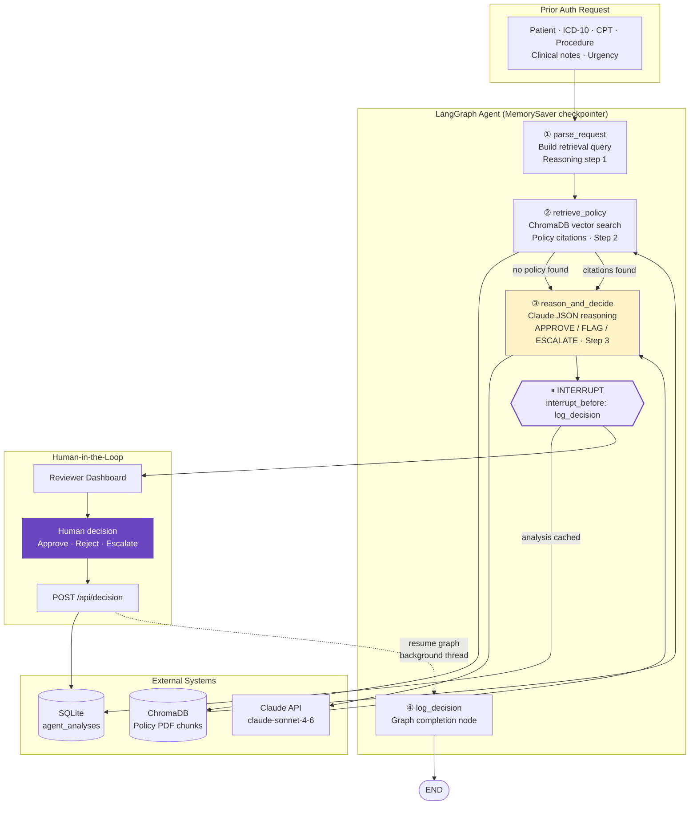

# ClearAuth LangGraph Agent Interaction

Visual reference for how the prior authorization agent runs, pauses, and resumes.

## Diagram (SVG)

## Mermaid source

## Node responsibilities

| Node | Reads from state | Writes to state |
|------|----------------|-----------------|
| `parse_request` | Patient request fields | `parsed_query`, reasoning step 1 |
| `retrieve_policy` | `parsed_query` | `policy_citations`, reasoning step 2; may set `error=NO_POLICY_FOUND` |
| `reason_and_decide` | Request + citations | `ai_decision`, `confidence_score`, reasoning step 3 |
| `log_decision` | Full state | (no-op; graph completion only) |

## Interrupt and resume

1. `agent_graph.invoke(initial_state, config)` runs until the interrupt before `log_decision`.
2. FastAPI persists the analysis to `agent_analyses` and stores the thread config in `pending_states`.
3. The dashboard shows the recommendation; the human submits a decision via `POST /api/decision`.
4. Human decision is written to `human_decisions` immediately (fast response).
5. A background thread calls `agent_graph.invoke(None, config)` to resume and complete `log_decision`.

## Business rules (outside graph)

Applied in `main.py` after the agent returns:

- **Emergent** urgency → force `ESCALATE`
- **Confidence &lt; 0.60** → force `ESCALATE`
- **Reject** requires a written reason
